# Zenith

Zenith is a dark-themed astronomy planning platform built with Next.js, Prisma, PostgreSQL, Auth.js, and Leaflet. It helps users find stargazing locations, review sky conditions, inspect astronomy data, and organize community meetups.

## Project Overview

Zenith combines a location-first map experience with authenticated dashboards and meetup coordination. The app is designed as a portfolio-ready full-stack project with a strong emphasis on responsive UI, clear data flow, and production-oriented runtime behavior.

## Features

- Interactive map for finding and saving dark-sky locations.
- Weather, light pollution, Zenith Score, and astronomy intelligence panels.
- Community meetup browsing with pagination, filtering, and sorting.
- Protected dashboard with saved-location and meetup analytics.
- Google OAuth sign-in with optional GitHub sign-in.
- Loading, empty, and error states across the major routes.
- Accessible navigation, menu controls, and form interactions.

## Architecture

```text
Browser
	|
	v
Next.js App Router
	|-- Server Components / Server Actions
	|-- Route Handlers
	|-- Metadata / SEO
	|
	+--> Auth.js + Prisma Adapter ---> PostgreSQL (Users, Accounts, Sessions)
	|
	+--> Meetup Service (Prisma skip/take pagination)
	+--> Dashboard Stats Service
	+--> Weather API (OpenWeather)
	+--> Map Search / Reverse Geocoding (Nominatim)
	+--> Astronomy + Zenith Score services
	|
	v
Leaflet client map + UI components
```

## Proofs

The repository includes a full proof set in `Zenith-Proofs/` so the README can show the real product flow, not just a summary.

| What is included | Count |
| --- | --- |
| Screenshots | 14 |
| Demo videos | 2 |

### Entry and Navigation

<table>
	<tr>
		<td align="center" width="50%">
			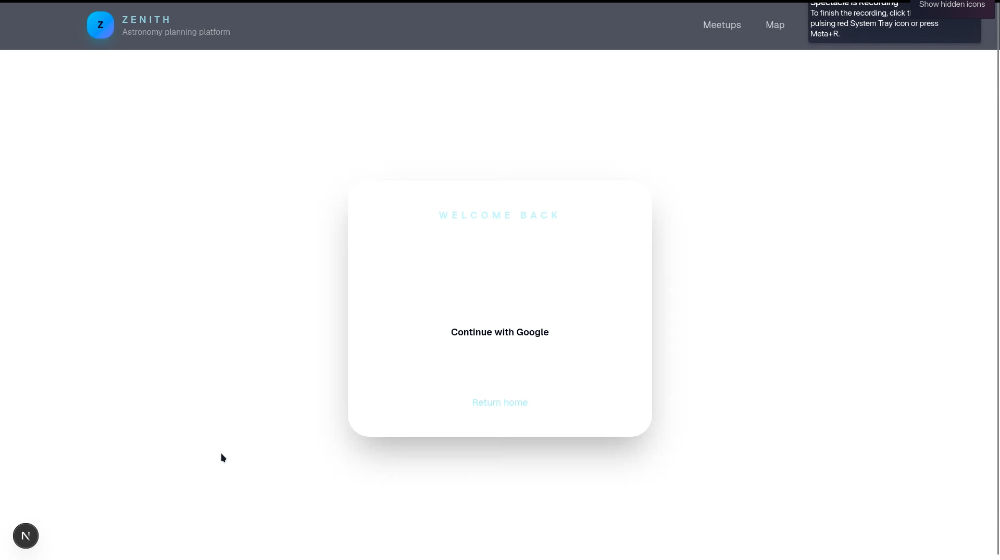<br>
			<strong>Login page</strong>
		</td>
		<td align="center" width="50%">
			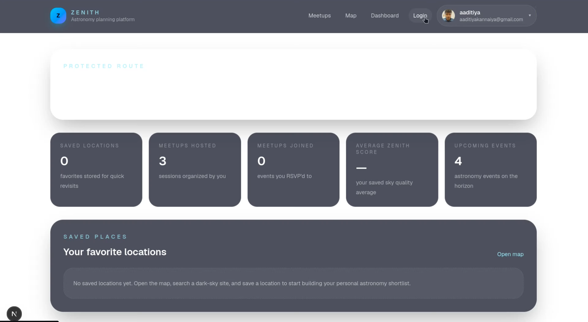<br>
			<strong>Dashboard</strong>
		</td>
	</tr>
	<tr>
		<td align="center" width="50%">
			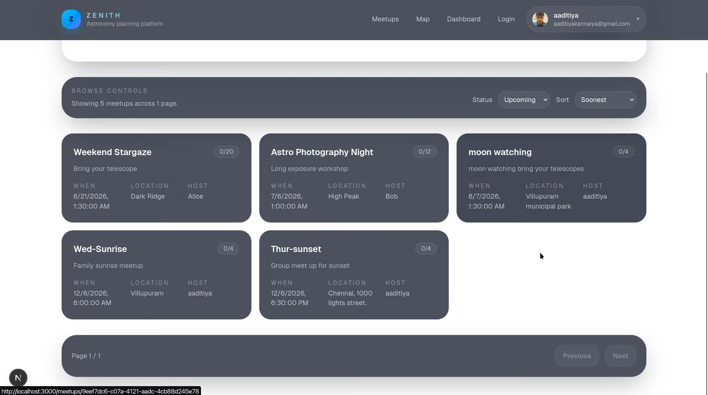<br>
			<strong>Meetups listing</strong>
		</td>
		<td align="center" width="50%">
			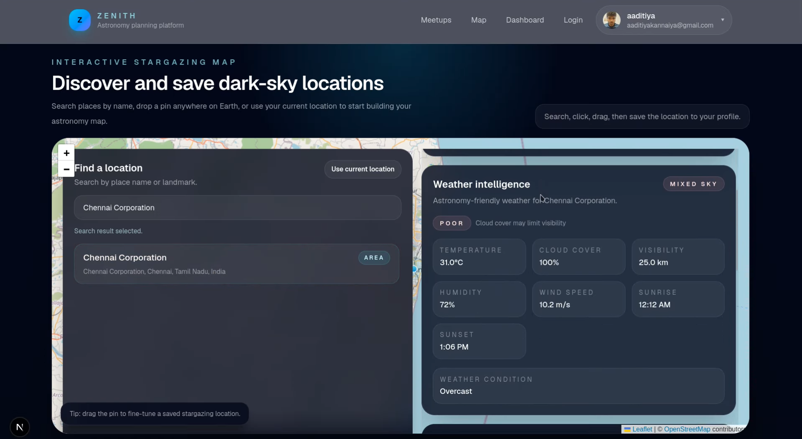<br>
			<strong>New location</strong>
		</td>
	</tr>
</table>

### Intelligence Panels

<table>
	<tr>
		<td align="center" width="50%">
			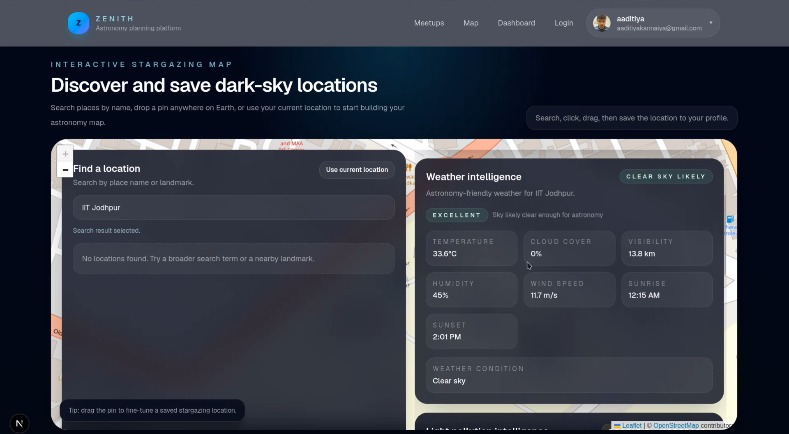<br>
			<strong>Weather intelligence</strong>
		</td>
		<td align="center" width="50%">
			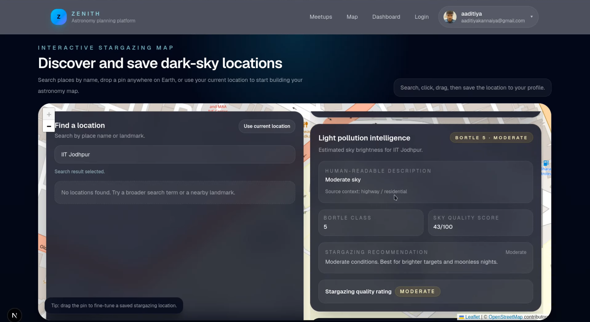<br>
			<strong>Light pollution intelligence</strong>
		</td>
	</tr>
	<tr>
		<td align="center" width="50%">
			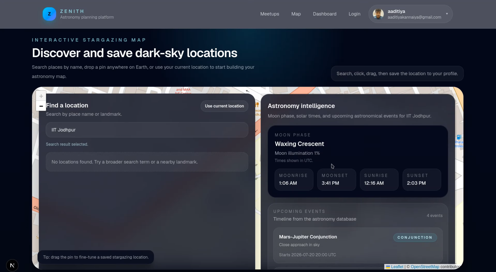<br>
			<strong>Astronomy intelligence</strong>
		</td>
		<td align="center" width="50%">
			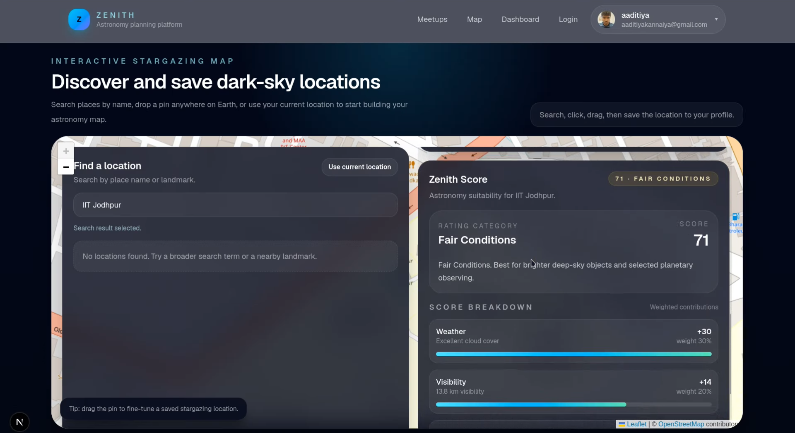<br>
			<strong>Zenith score</strong>
		</td>
	</tr>
	<tr>
		<td align="center" width="50%">
			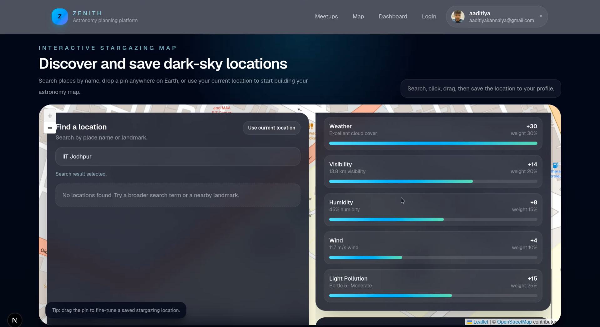<br>
			<strong>Score breakdown</strong>
		</td>
		<td align="center" width="50%">
			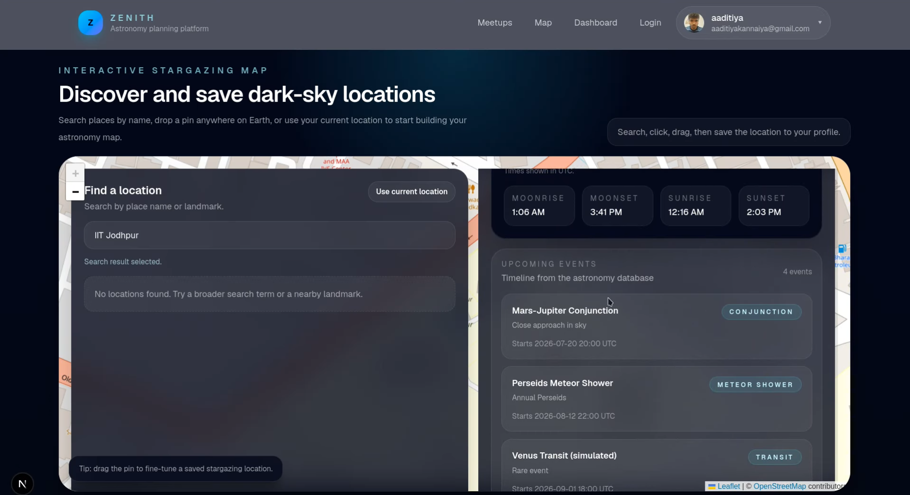<br>
			<strong>Upcoming astronomical events</strong>
		</td>
	</tr>
</table>

### Meetup and Location Flow

<table>
	<tr>
		<td align="center" width="50%">
			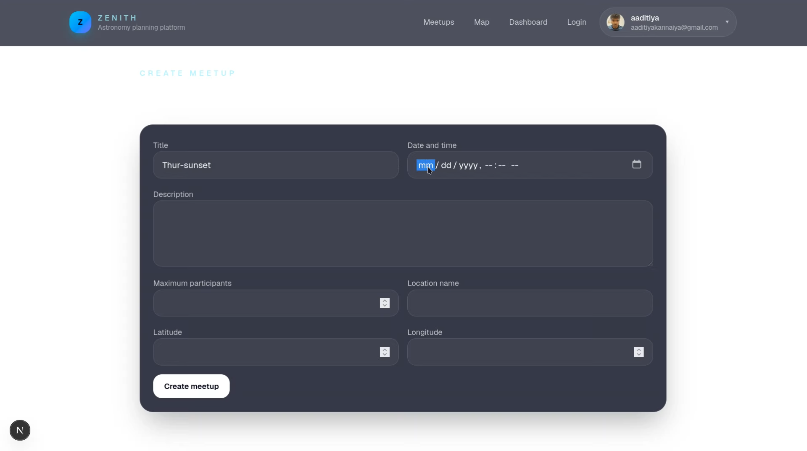<br>
			<strong>Create meetup</strong>
		</td>
		<td align="center" width="50%">
			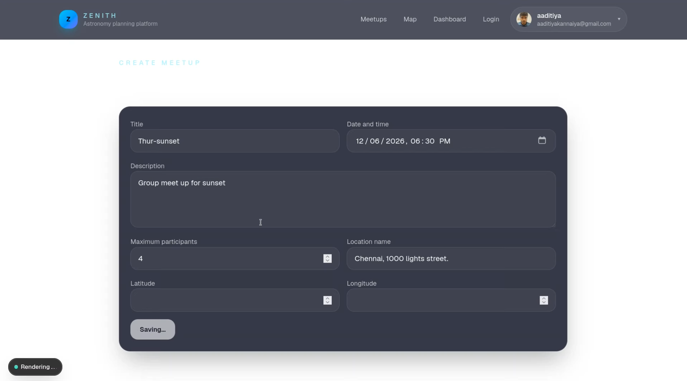<br>
			<strong>Meetup creation</strong>
		</td>
	</tr>
	<tr>
		<td align="center" width="50%">
			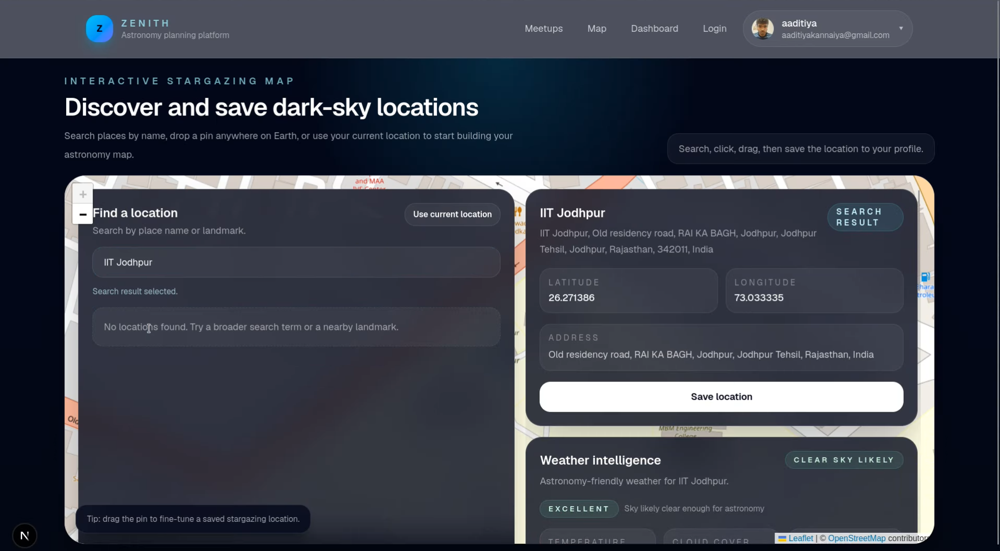<br>
			<strong>Address lookup</strong>
		</td>
		<td align="center" width="50%">
			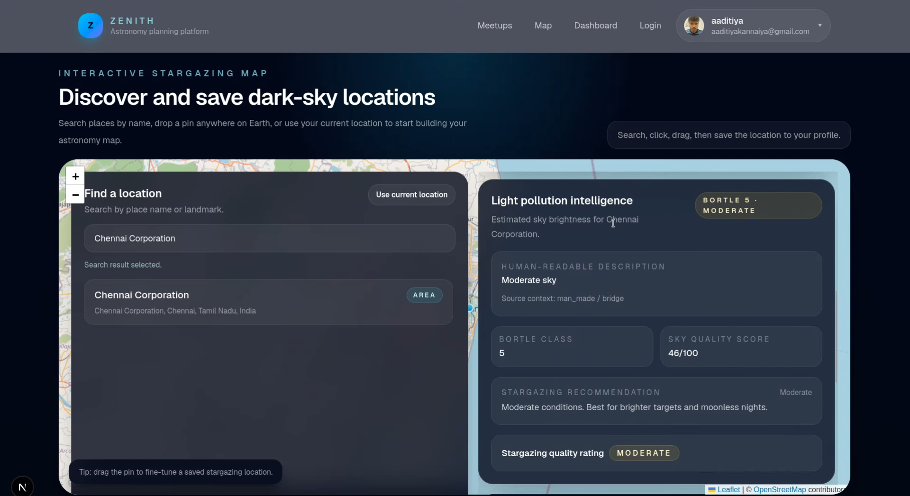<br>
			<strong>New location light pollution</strong>
		</td>
	</tr>
</table>

### Demo Videos

#### Search Flow


#### Meetup Creation Flow
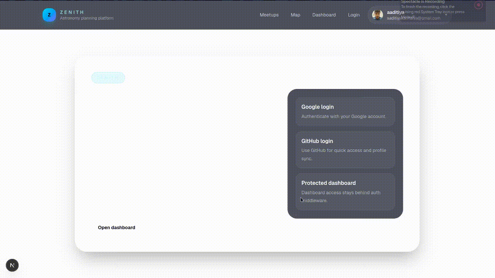

#### Login Flow


#### Full Demo Video
[Watch Full Demo](Zenith-Proofs/Videos/Full_demo.mp4)

#### Login Flow Video
[Watch Login Video](Zenith-Proofs/Videos/Login.mp4)

## Tech Stack

- Next.js 16 App Router
- React 19
- TypeScript
- Tailwind CSS
- Prisma ORM 7
- PostgreSQL
- Auth.js / NextAuth
- Leaflet + React Leaflet
- OpenWeather API
- Nominatim geocoding
- SunCalc for astronomy calculations

## Database Design Summary

Core data is modeled in Prisma with PostgreSQL:

- `User` stores account identity, roles, and profile metadata.
- `Account`, `Session`, and `VerificationToken` power Auth.js session storage.
- `Location` stores saved stargazing spots and score data.
- `FavoriteLocation` connects users to saved locations.
- `Meetup` stores meetup lifecycle data, host linkage, and location details.
- `MeetupParticipant` stores RSVP membership.
- `AstronomicalEvent` stores upcoming astronomy events.

Meetup browsing uses Prisma `skip` / `take` pagination with filter and sort preservation.

## Authentication Flow

1. User clicks Google sign-in from `/login`.
2. Auth.js redirects to Google OAuth.
3. Google returns to `/api/auth/callback/google`.
4. Auth.js links or creates the Prisma user/account.
5. Auth.js creates a database session.
6. The app redirects the user to the requested callback URL.
7. Protected pages read the session through `auth()` and middleware.

## Setup Instructions

```bash
npm install
npx prisma generate
npx prisma migrate deploy
npm run dev
```

Open `http://localhost:3000` in your browser.

## Environment Variables

Required:

- `DATABASE_URL`
- `OPENWEATHER_API_KEY`
- `AUTH_SECRET`
- `AUTH_GOOGLE_ID`
- `AUTH_GOOGLE_SECRET`

Optional:

- `AUTH_GITHUB_ID`
- `AUTH_GITHUB_SECRET`

## Deployment Instructions

1. Set all required environment variables in your hosting provider.
2. Run Prisma migrations before the first production boot.
3. Set Google OAuth redirect URIs for your deployed domain and local development.
4. Build the app with `npm run build`.
5. Deploy the application.
6. Verify sign-in, dashboard access, meetup browsing, and logout.

## Future Improvements

- Replace the remaining `middleware.ts` warning with `proxy.ts`.
- Add screenshot assets to the repository.
- Expand meetup filters by region or date range.
- Add user profile editing and saved-location management.
- Add richer astronomy event detail pages.
- Add background jobs for periodic weather and astronomy refreshes.
